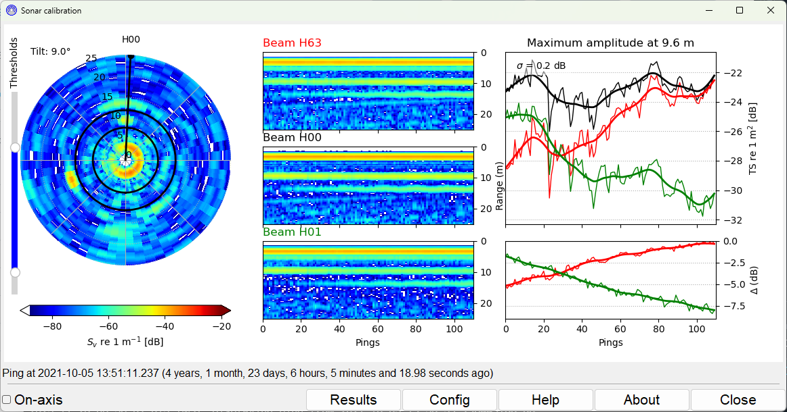
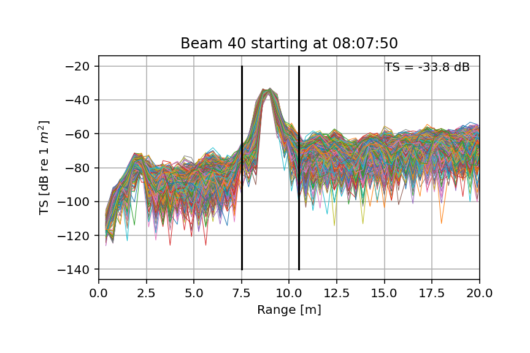

# User Manual

???+ note

    This manual is under development.

## Introduction

This is the user documentation for the sonarcal program.

The development of the current form of this program was supported by [AZTI](https://www.azti.es/en/). Earlier versions were developed while the author was employed at the Norwegian [Institute of Marine Research](https://www.hi.no).

## How to use

{ align=right }
/// caption
The main operation screen.
///

{ align=right }
/// caption
The seconday display of ping amplitudes.
///

## Configuration

some text

## Export of data

some text

